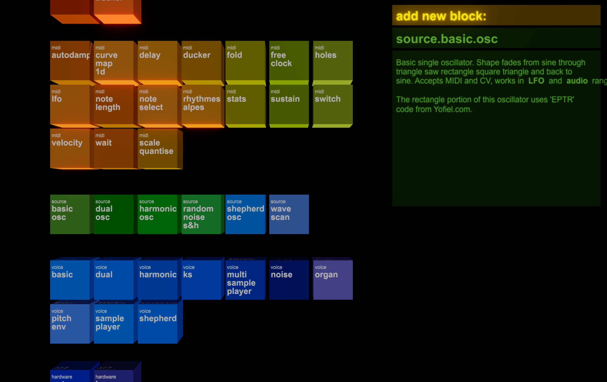
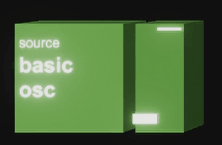
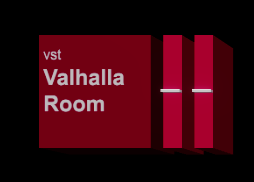
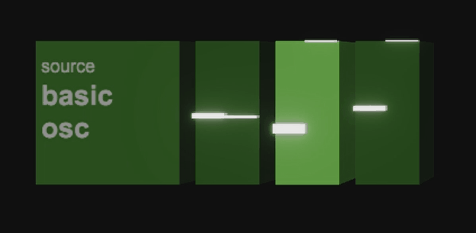

Every song in benny is made out of blocks. Blocks are either midi processors, audio processors, representations of hardware attached to the computer or interfaces to control more general things like tempo or tuning system.

## Adding a block

{ align = right }

Press enter, double click the background or just start typing the name of what you want, to bring up the new block menu.

## Types of blocks

### Audio

Here is an audio block. This one is an oscillator. Audio blocks have 2 audio inputs, 2 audio outputs, and as many midi inputs and outputs as they want. This block has one voice, represented by the single cuboid section to the right, which has the two meters showing the voice's outputs.

This is a VST plugin block, which has it's 1 voice split into 2 thinner slices to show you it is a stereo-in stereo-out voice.

This is a hardware block. Hardware blocks have meters for both benny's output to them and the signals they send back. Benny automatically applies a very transparent aliasing-suppressing softclip and dither to all audio outputs to hardware.

#### Audio meters

In benny audio meters (both on blocks and elsewhere) always show the minimum and maximum values that happened during the last frame of video. This is so that you can meaningfully observe signal levels and dynamics and/or cv values.

### Midi

This block has no audio processing; it is a midi block representing both the keyboard I have connected and the QWERTY keys (when enabled).

#### Midi meters

On midi blocks the meter is a cuboid stretched between the lowest note, the highest note (on the x axis) and the lowest and highest velocities (on the y-axis). The number of currently held notes is indicated by the z-axis/height of the cuboid.

Some midi blocks output 1-dimensional values, and the meter for these is just a single bar per voice.

## Polyphony

If you press - or + while a block is selected you'll add or remove voices to it. This oscillator has 3 voices, which you can see as additional cuboid slices on the end. Each voice has its own meters. You can connect midi to the the block (which will handle polyphonic midi allocation) or to individual voices. You can adjust and modulate voices all together or separately. Every voice's audio ins and outs are available separately.

If you click the cube, you select the whole block. If you click an individual voice's cuboid you select just that voice. See the sidebar section for more on this.

## Interacting

You can click blocks to select. Shift click to select more. Shift drag to select in a rectangle.

Drag (or arrow keys) to move, drag from one to another to make a new connection. Drag the background to pan around, scroll on the background (or ctrl-drag) to zoom. Home zooms out to show all blocks.

Ctrl-click mutes a block. Alt-click bypasses it. Ctrl-C, -V, -X do copy / paste / cut.