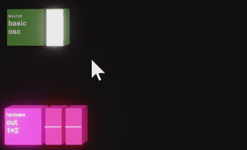
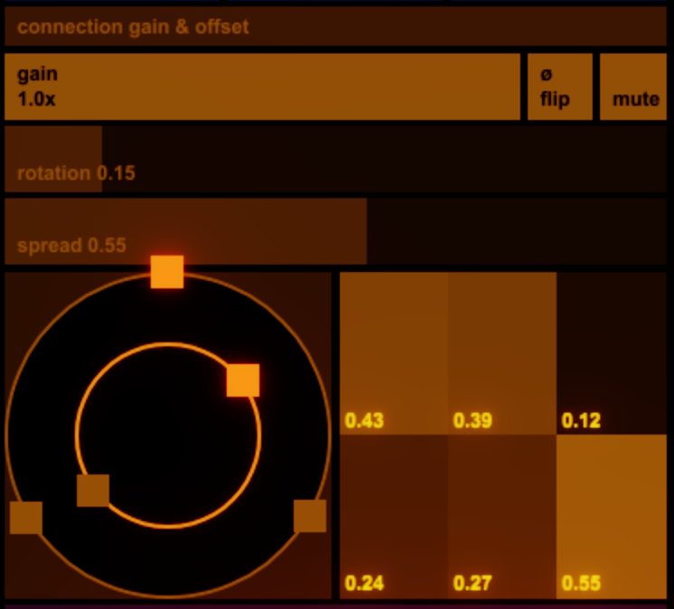
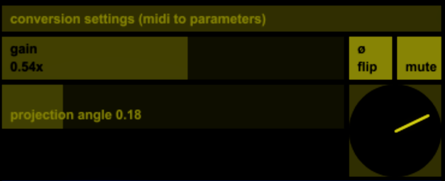
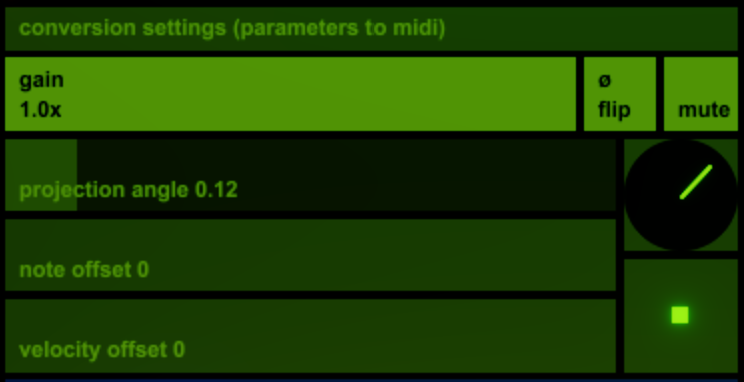

In benny you can connect anything to anything.

Drag the source block onto the destination block.

To connect just one voice, drag to or from just the voice rather than the main block.

A wire will appear, and the sidebar will show the connection detail edit view.

Here you can select source voice(s), output, destination voice(s) and input. Hitting enter will collapse these choices to the defaults. You can always come back and change any one of them later.

There are scopes for both input and output of the connection (where possible).

Wire colours reflect the type of output/input they come from.

- white : not assigned yet

- green : values/parameters

- yellow : midi/notes

- orange : audio 

## Conversion

Some connections are simple - eg a midi out to a midi in, or a single audio out to a single audio in. Some require some degree of conversion, which is handled by benny.

All connections get a gain/scale control, the ability to flip (invert) their values and a mute button. You can mute a connection by ctrl-click on the wire. You can adjust a connection's level by ctrl-scroll over the wire.

Where relevant, connections have offset controls (eg to transpose a midi stream, or add to its velocity).

When an audio connection is many-to-many, one-to-many or many-to-one, benny shows you the rotate/spread control. This lets you access one set of possible ways of mixing outputs to inputs. It is easy to make ideas such as a polysynth where the next voice's envelope triggers the current voice's filter using this feature.

When a connection goes from midi (which is a 2-dimensional value, having both pitch and velocity) to a parameter value or to an audio input (which are both 1-dimensional values), benny shows the 'projection angle' control. 

As on the midi scopes, the Y axis represents velocity, the X axis represents pitch. So: 

- With the control pointing straight up the output is related only to velocity. 

- With it pointing down the output is inversely related to velocity.

- If it points horizontally right the output is related only to pitch. 

- Left, to inverse of pitch.

- Angles between are some combination of these.

When a 1-dimensional value is sent to a midi input, the converse happens. 

Using the projection control and pitch and velocity offset sliders you can determine what kind of notes are generated by your incoming value stream - it can affect velocity or pitch or both. 

The midi scopes will help you understand what's going on.