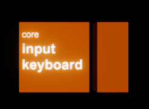

benny is designed to make midi control as fluid as possible. It also attempts to make life easy if you need to change the controllers you use but still play your old songfiles.

## Controllers

Controllers - that is midi devices with knobs, sliders or other ways of generating 1-dimensional midi CC or pitchbend messages - are handled by two blocks: core.control.auto and core.control.basic

### core.input.control.auto

There can only be one of these core.input.control.auto blocks present at a time. The controller linked to this block can be used for automap and normal connections. 

#### Automap

If automap mode is enabled for the block then when something is selected the controller will map to it. Controllers (eg midi fighter twister) with encoders and RGB leds and value feedback are ideal for this. With a suitable controller the colours and on/off status of knobs match the onscreen ui layout. If nothing is selected then the controller takes on the colours set in the block's parameters and acts in basic mode (see next section).

In the hardware editor you can assign midi buttons to toggle automap mode enable.

In automap mode if the selected block has more parameters than can be mapped there is an onscreen button to move to the next page of controls. This can also be linked to a midi button in the hardware editor.

You can click the controller icon at the top of the sidebar to toggle automap lock for the controller and it'll stay mapped even if you select something else (or nothing).

#### Connections

If automap mode is off or nothing is selected the controller is in basic mode. You can connect from the controller's outputs to any block just like any other connection in benny. If the controller has per-knob leds they'll light to indicate active connections. On the new connection sidebar view you can move a control on your controller to select it in the list.

### core.input.control.basic

There can be as many of these as you want. Pick the physical controller and then you can connect from its outputs to any destination in benny just like any other connection.

## Keyboards

Keyboards or grid devices or drum pads or the QWERTY keyboard or any other device that mainly generates midi note messages are handled by the core.input.keyboard block.

QWERTY input needs to be enabled in the block parameters AND capslock needs to be on. The bottom octave starts at C = Z, the top octaves start at C = Q, , and L are up and down octave controls.

#### Automap

If the core.input.keyboard block's 'automap' parameter is set to ON then when you select a block or voice that has a midi input the keyboard will map to it automatically. If the block has multiple inputs they'll be listed as buttons so you can choose. If you click the keyboard graphic it toggles *automap lock* and the keyboard will remain mapped even when you select something (or nothing) else.

#### Connections

You can also connect from the core.input.keyboard block to any other block's midi input like any other midi connection.

The block also has outputs for modulation, pitchbend (+, -, both) and sustain. If you have a keyboard like the CME XKEY range that outputs continuous polyphonic pressure messages in the form of more note-ons then the pressure output here outputs them. There is a time quantiser for these pressure messages that is synced to the global clock.

## Substitution

In the hardware editor for each controller you define you can also select fallback substitutes. These also have to be fully defined in the hardware editor too. 

For example in my profile I have entries for LPD-8 and LPD-8 MK II. Each is defined as a possible substitute for the other, so in old songs that expect the LPD-8 (which broke) benny finds the MK II attached and uses that instead (and even though they're configured to use different CCs benny abstracts that fact out of your way).

If, for example on tour, a piece of equipment fails, as long as you can find a vaguely similar replacement you can define that in the hardware editor, set it as the substitute for the failed item, and just load all your songs without having to think about it again.