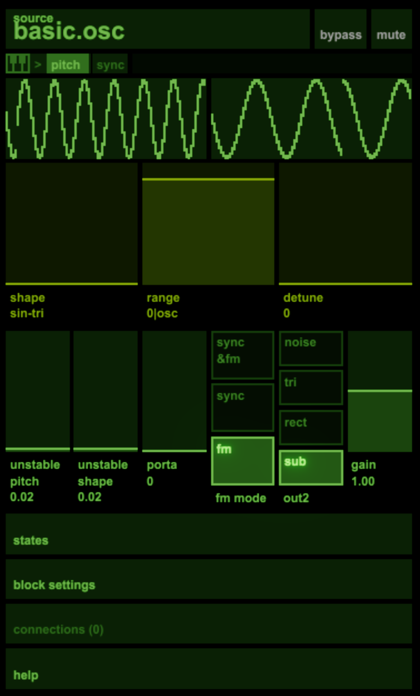
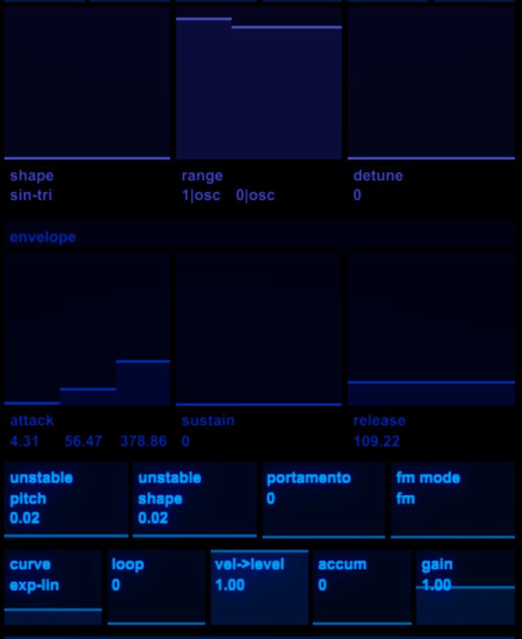
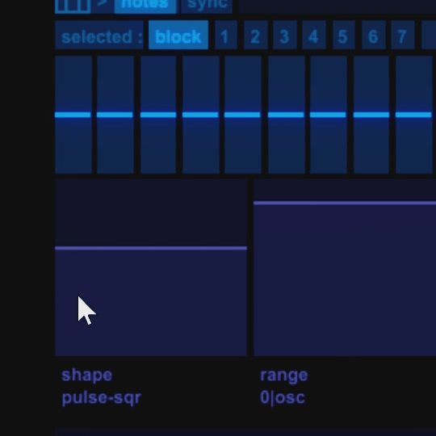
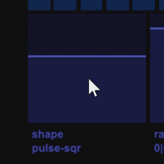
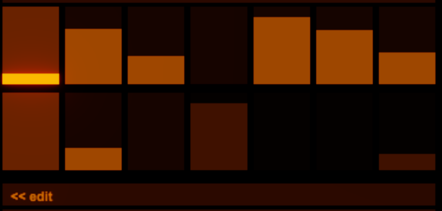
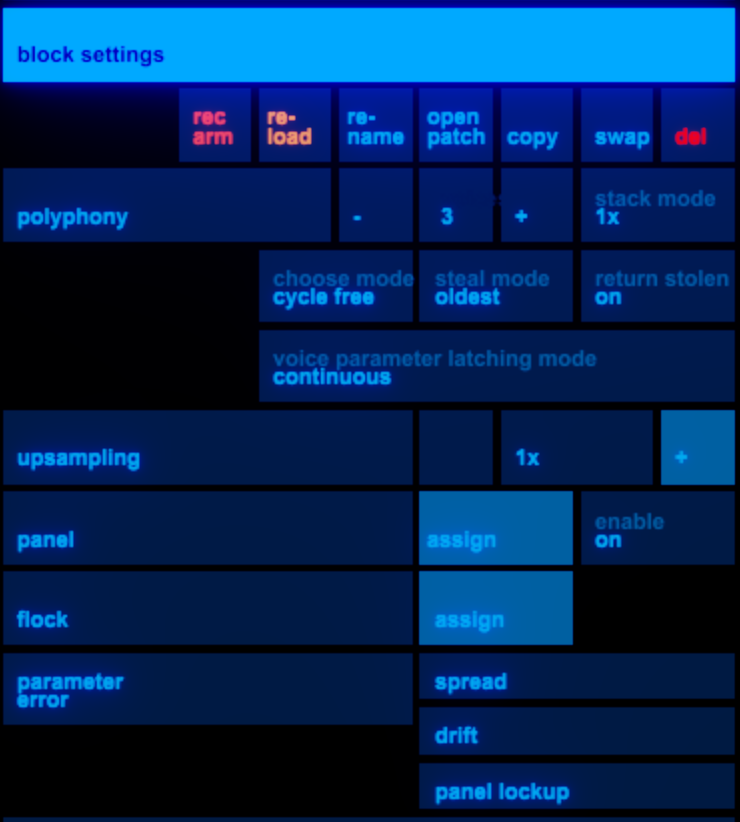
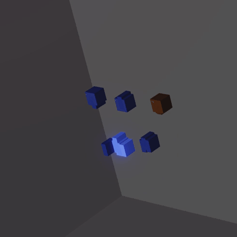
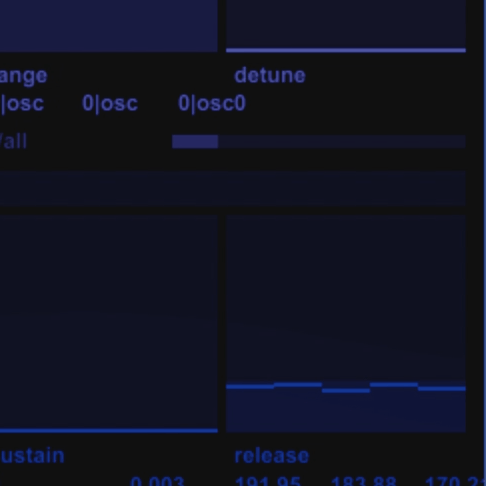
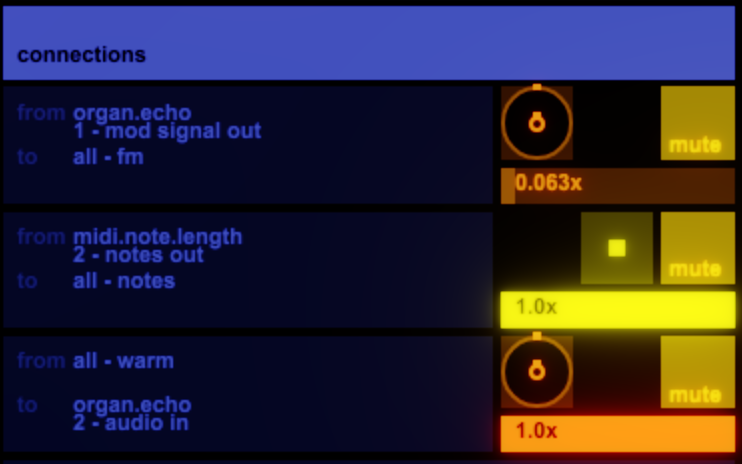

The sidebar shows the details of whatever you're looking at.

# Blocks

With a single block selected the sidebar shows you all of its settings. Click the section headers to move through them.

If a block has multiple voices there'll a be a section like this where you can choose to select and adjust either the whole block or an individual voice.

## Scopes

Audio blocks have a scope for each output. The scrollwheel (or dragging up and down) lets you zoom these scopes. Red shows values that go outside the normal ranges (though there is no clipping on connections between blocks).

Midi scopes show the notes currently playing.

## Parameters

This section shows the parameters for the block. Drag or use your scroll wheel to adjust parameters. 

**Shift** for fine adjust.

**Alt+shift** for extra fine. 

**Alt-click** returns a value to its default (or if you loaded the songfile from disk, to the value it was in the last save).

On these sliders, the darker bar represents the set value of the voice's parameter and the brighter line that usually sits at the end of that bar represents the current actual value. If a parameter is modulated you will see the line moving but not the bar.

If a block has multiple voices then while you hold **ctrl and mouse over** a slider it will highlight it and let you adjust that one individually. 

**Ctrl+Alt** lets you tilt all the values of the individual voices around the one you are hovering over.

## Mini-ui

Here's an example of a block with a mini-ui showing what it is doing. Some of these allow mouse interaction. Often they'll have an 'edit' button at the bottom which brings up a full-featured version of the editor on the rest of the screen.

## Block settings

Reload - does a full hard reload of the block's code.

Swap - lets you swap a block out for a different one.

Copy paste del do what you would expect.

Open patch - opens the max patcher for the first voice of the block.

### Polyphonic note allocation modes

Here you set the number of voices and select the mode for picking what voice a new note goes to. There are separate mode settings for how it allocates a note to a currently inactive voice and for when the new note has to steal a currently active voice:

- **Blind cycle** - each note that comes in is allocated to the next voice in turn, without concern for whether that voice is playing or whether the same note is already playing on another voice.

- **Blind random** - likewise but the next voice is picked at random

- **Cycle free** - the next free voice is picked, working around in order.

- **Cycle random** - a voice is picked at random from the currently unused ones.

- **Notememory** - it keeps track of which voice last played a particular note and returns to that one. This is how (for example) the Prophet 600 allocated notes to voices.

In the two 'blind' modes successive triggers of the same note (without a noteoff inbetween) get new voices. In the other modes they are allocated to the same voice. The non-blind modes work well with keyboards that send poly pressure messages as a stream of noteon velocities.

There are three other controls:

**Return stolen** - if a held note is stopped due to the voice being stolen by a new one and that new note ends, this enables the held note restarting.

**Stack** - plays mutliples of notes, or adds suboctave notes.

**Latching** - only implemented on a few blocks so far, this gives the option for parameters to update only when note on and/or note off events occur (as opposed to continuously, as is the default).

### Panel assign

Press the panel assign button to put the sidebar into a mode where you can select parameters to be shown on the [panels](panels.md) page.

### Flock

benny lets you attach up to 3 parameters to the position of imaginary creatures in a flocking simulation. Once you've assigned parameters to axes using the flock assign button you can adjust the properties of the simulation:

- weight

- tension of the spring connecting the creature to the parameter value 

- friction

- attraction or repulsion from one another

- random movement

- desire to align their motion with the others

This feature can be useful for creating interesting chaotic autovariation, fun parameter-smoothing/overshoot, and for making voices try not to occupy exactly the same parameter space as each other.

Ctrl+click on the blocks button in the top bar brings up a visualisation of all flocked blocks.

### Parameter errors

You can introduce per-voice static errors, a gradual (per-voice) drift of parameters, and there is also a 'panel lockup' feature which simulates something my slightly broken Prophet 600 does where randomly, for a few moments, a parameter will stop updating for just one voice.

## States

When you open this section of the sidebar it lets you store the current parameter values to a [State](states.md). States that already have values stored in them (either for this block or for others in the song) are highlighted with a border. Alt-click lets you remove this block from a state.

When this section is not open for editting it just shows buttons that let you fire the states **for this block only**.

## Connections

Here you can see a list of all the connections to and from this block. You can edit them here or click them to bring up the [detailed connection edit view](connections.md).

## Help

This shows the help text for the block (also visible when you hover over the block in the new block menu).